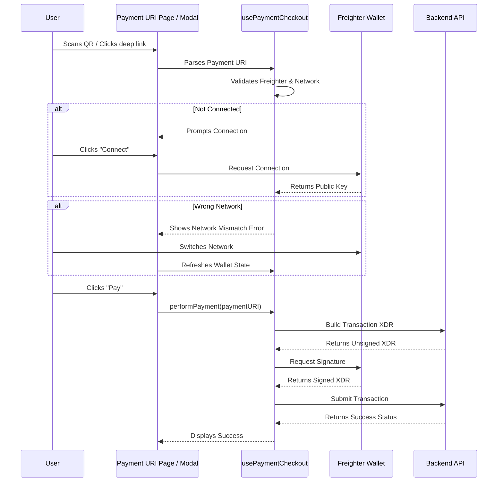

# Payment URI and Checkout Flow

StellarSplit integrates Stellar Payment URIs (`web+stellar:pay`) to facilitate seamless cross-device and deep-linked payments. This flow allows users to scan a QR code or click a link to initiate a payment securely via Freighter.

## Flow Overview

The payment checkout process relies on the `usePaymentCheckout` hook, which wraps the `useWallet` hook to manage connection state, network validation, and transaction submission.

## Core Components

### 1. `PaymentURIPage`
The dedicated page for handling deep links (`/pay?uri=...`). It displays the payment details and network status, and handles the actual payment submission using `PaymentURIHandler`.

### 2. `PaymentModal`
A modal used within the app (e.g., when viewing a split) to confirm payments. It displays a QR code for cross-device payments and allows scanning other devices' QR codes using `QRCodeScanner`.

### 3. `usePaymentCheckout` Hook
This hook orchestrates the payment flow and provides state variables like `canTransact`, `status`, and `error`, along with `connect`, `refresh`, and `performPayment` functions. It acts as an abstraction over `useWallet`.

### 4. `PaymentURIHandler`
A component that parses the `web+stellar:pay` URI and invokes the appropriate handlers when the user confirms the transaction.

## Network Mismatch Handling

The frontend actively blocks payments if the wallet is on the wrong network.
- `useWallet` determines `walletNetworkPassphrase` and checks `isExpectedNetwork(walletNetworkPassphrase)`.
- If there's a mismatch, `canTransact` is set to `false`.
- The UI gracefully degrades, displaying warnings like: *Network mismatch. Expected {requiredNetworkLabel} but wallet is on {walletNetworkLabel}.*
- The "Pay" or "Confirm" buttons are disabled until the user corrects the network in Freighter and the state is refreshed (either automatically via window focus/visibility changes or by clicking a "Refresh Wallet" button).
